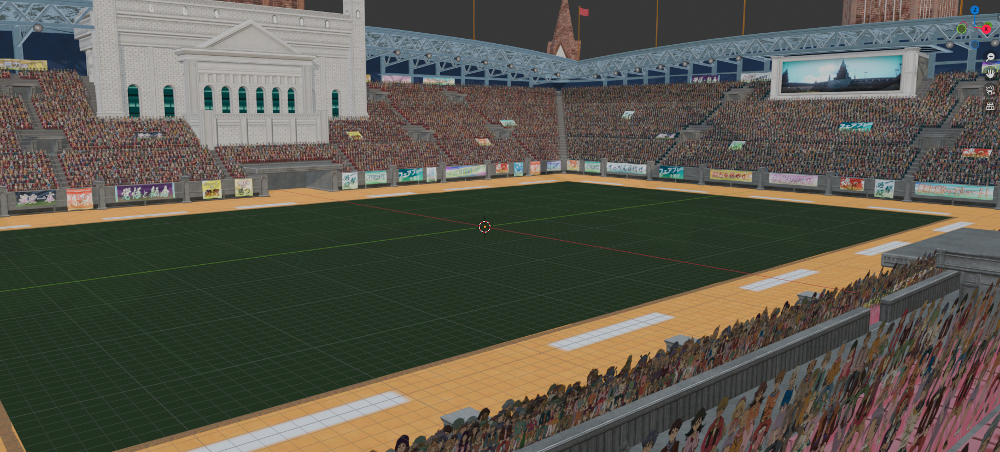
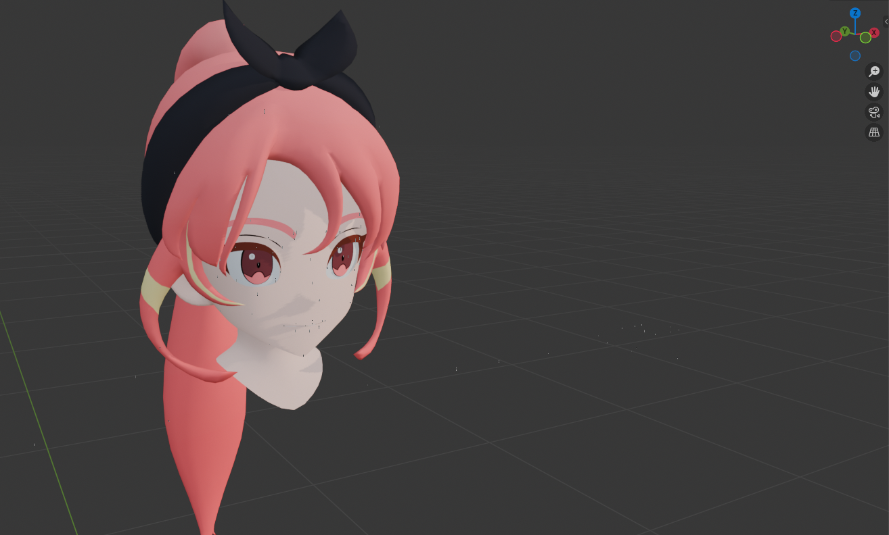
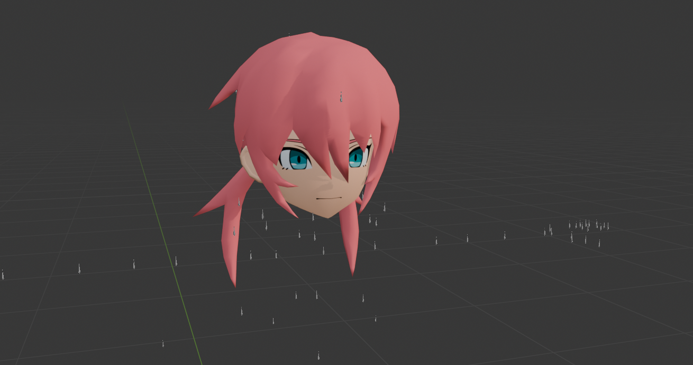

# Level-5 G4 Blender Tools

Import models, characters, maps and textures from Level-5 G4-based games directly into Blender, and port edited Blender/DAE geometry back to conservative `G4MD/G4MG/G4TX` packages.

The repository ships one unified Blender add-on:

* `Level-5 G4 Blender Tools`: models, animation, cameras and port/export tools in one flat add-on package.

The importer automatically converts G4 assets into Blender-compatible data, recreating materials, textures and skeletons with minimal user interaction. The port exporter wraps the same parser/validator stack and patches a native model base conservatively instead of rebuilding unknown format tables from scratch.



## Features

### Importer

* Direct import from Blender.
* Drag & drop support.
* Automatic texture extraction.
* Automatic material generation.
* Automatic texture assignment.
* Character rigging support.
* Manual body, shoes and sleeve/collar composition for character rigs.
* Shared skeleton resolution.
* G4SK rest bone orientation reconstruction.
* Full map importing.
* Automatic map placement and instancing from the world G4PK/G4SK hierarchy.
* Batch processing support.
* Automatic scene reconstruction.
* Direct G4MT and animation G4PK import.
* G4CM camera import synchronized with character animation.
* Full event-folder reconstruction with one rig per actor and editable NLA cuts.
* Event naming support for Victory Road and Ni no Kuni II conventions.
* Per-cut character lighting reconstructed from `EventMap_fix` resources.
* Detailed character outlines driven by the model's authored outline parameters.

### Port Exporter

* Export edited Blender/DAE geometry into a native `G4MD/G4MG` pair.
* Preserve native layouts, materials, hashes, texture references and record structure where possible.
* Copy or rebuild `G4TX` texture archives from a native base.
* Read and write Nintendo Switch `NXTCH` texture payloads with automatic `dx11` to `nx` fallback.
* Replace individual G4TX entries from an explicit texture list; empty entries remain untouched.
* Resolve Collada skin controllers and Blender-exported weight sidecars.
* Validate generated records, palettes, indices and packed weight sums before writing packages.
* Build port settings from the selected original model instead of shipping model-specific bone presets.

## Supported Formats

| Format | Description             |
| ------ | ----------------------- |
| G4MD   | Model files             |
| G4PKM  | Packed model containers |
| G4SK   | Skeleton files          |
| G4TX   | Texture archives        |
| G4MT   | Character animation     |
| G4CM   | Camera animation        |
| G4PK   | Animation containers    |
| NXTCH  | Nintendo Switch texture |
| P3LIP  | Lip-sync sequences      |

## Installation

Install this repository as a single Blender add-on package. The root `__init__.py` is the only add-on entry point; helper scripts and lookup data live next to it at the same level.

The add-on package includes:

```text
|-- __init__.py
|-- g4_port_addon.py
|-- g4_port.py
|-- g4_model_probe.py
|-- g4_animation_addon.py
|-- g4_event.py
|-- g4mt_motion.py
|-- g4mt_probe.py
|-- g4cm_camera.py
|-- g4pk_extract_g4mt.py
|-- g4_p3lip.py
`-- chara_model_lookup.json
```

In Blender, enable `Level-5 G4 Blender Tools` and use:

```text
File > Import > Level-5 G4 Model
File > Import > Level-5 G4 Model Folder
File > Import > Attach Level-5 G4 Character Parts
File > Import > Level-5 G4 Animation
File > Import > Level-5 G4 Camera
File > Import > Level-5 G4 Event Folder
File > Export > Level-5 G4 Port
View3D > Sidebar > Level-5 > G4 Port
```

The exporter needs a legally obtained native model base from a complete game dump. The original model defines the compatible record structure, materials, palettes and texture archive that the port operation patches.

## Character Rigging





The importer supports character skeletons and skinning data.

Character heads named `cXXXXXXXX` can be completed with their separate
`uXXXXXXXX` body and `sXXXXXXXX` shoes. Some modular outfits also provide an
`skXXXXXXXX` sleeves/collar part. After selecting a single animation,
Blender opens three explicit selectors in sequence: character model, body and
shoes. Cancelling the body or shoes selector skips only that part; no uniform
is guessed from an ID. Direct model imports expose equivalent manual fields.
Existing rigs can also use `Attach Level-5 G4 Character Parts` from the Import
menu. Secondary LOD meshes are discarded during import so LOD0, LOD1 and LOD2
do not deform visibly at the same time.

Event-folder import opens one assignment list containing every character actor
before building the batch scene. Head, body and shoes paths can be populated
from that dialog; an empty head uses the model encoded by the event and empty
body/shoes fields skip those parts. Assignments are retained in the addon
preferences for later events. Head substitution is intentionally restricted to
event-folder import. Repeated instances of one model use separate slot entries
such as `c000101_s00` and `c000101_s01`.

Many character models do not store their skeleton locally and instead reference shared skeletons located elsewhere in the game's data.

The addon includes a preprocessed `chara_model_lookup.json` for shared skeleton lookup. The source files still need to come from a complete game dump containing the shared skeleton files located under:

```text
data/common/chr/
├── c000101/
├── c000102/
├── c002001/
├── c002202/
├── c003001/
├── c004001/
└── c004202/
```

If these directories are present, the importer will automatically locate and load the required skeletons during import.

After Collada import, Blender may display imported bones with vertical default
tails. `Apply Bone Orientation` can improve that visual presentation, but it
changes Blender's local bone axes and is therefore disabled by default. G4MT
imports always preserve the original G4SK axes; a previously reoriented
selected rig is replaced with a fresh animation-safe rig. When visual
orientation is enabled, the original rest quaternion is stored on each bone as
`g4_rest_rotation_xyzw`.

Bodies and shoes keep their native G4SK armature, bind pose, vertex groups and
weight palettes. G4MT tracks are applied independently to every character part
whose bone CRC/name matches a motion target. Uniform-only helpers such as
`_wgt_1_0`, sleeves and accessories remain unkeyed and inherit motion through
their native hierarchy. No vertex weights or part-specific bones are remapped.

Imported materials use a Level-5-style Eevee node graph with two hard shadow
regions instead of conventional smooth shading. The base texture keeps its
authored palette under Blender's Standard display transform with a restrained
saturation/value correction measured from the game reference. Cool authored
regions receive a channel-aware correction, keeping uniforms and ribbons blue
instead of turning grey while leaving skin and hair untouched. The RGB channels
of `oc` respectively darken and shift the primary region, release the secondary
shadow and restore painted albedo. `sp` is
projected from the view-space normal and `spm` masks the resulting matcap.
Character normal maps are decoded from the game's DXT5nm alpha/green layout and
drive both cel bands and view projection. Restrained light-facing and opposing
edge contributions approximate the original highlight/under-light pair without
washing out the painted albedo. Colored Blender lights tint the lit result
without moving the authored toon thresholds. A neutral **G4 Wetness** control
reconstructs the original runtime wet diffuse/specular response and defaults to
zero, so ordinary imports remain unchanged. RGB channels from `msk` are exposed as neutral `G4 Mask ... Tint`
nodes so recolour and skin parameters can be applied without using the mask as
alpha. Source-painted line work remains in the base texture.

The **Character Outline** preference controls character contours. **Simple**
(the default) combines a filtered Freestyle silhouette with Blender's
screen-space viewport outline. **Detailed** adds selected structural edge marks
and a screen-space cavity pass in the viewport. Both modes exclude auxiliary
eye and mouth planes, preventing those submeshes from producing false contours.
Changing the preference refreshes an existing G4 scene immediately; saved G4
scenes are also refreshed safely when opened or rendered in background mode.
**Outline Thickness** controls the main render silhouette in pixels (default
`1.65`, matched to the game reference); thin and internal lines follow it at
restrained proportional weights.
Hard modelled folds and material seams are marked selectively for a thinner
internal render line, preserving details such as ears, neck folds, fingers and
nails without exposing the mesh triangulation. Objects whose source `COLOR.B` weight is low receive a
second, thinner silhouette style. Character `line` textures larger than the
uniform 8x8 default are detected as authored UV outline controls and select the
same restrained silhouette style. Their blue channel also masks a narrow,
view-dependent inner edge, so black regions suppress outlines around eyes or
other authored details. Uniform blue defaults still enable a narrower inner
edge, reproducing features such as the ear contour in the viewport as well as
the render. A broader warm under-rim compensates for the deliberately
camera-oriented facial normals and restores the ear/side-plane shading visible
in the game. The original image remains exposed as **G4 Line
Parameter** without being baked destructively into the albedo. **Off**
disables both outline paths.
The source vertex `COLOR` channel used by the game's edge shaders is preserved
as **G4 Outline Parameters** without an interchange-format conversion.

Character meshes also receive a real **Level-5 Character Parameters** Geometry
Nodes modifier. Saturation, brightness, light/shadow floor, normal strength,
specular strength and wetness are exposed in the modifier and drive named
attributes consumed by the Character material, so routine tuning does not
require editing its shader graph.

Character geometry now enters Blender through the add-on's native
`level5-g4-native-mesh` payload. Positions, native normals, UVs, vertex `COLOR`,
joint palettes and all decoded skin influences are constructed with Blender's
data API instead of passing through `bpy.ops.wm.collada_import`. This is the
default path on Blender 4.x and 5.x; Collada is retained only as a compatibility
fallback for an old cache that does not contain the native payload.

## Map Reconstruction

Folder import reads the world-level `<world>.g4pk` beside the model folders.
Its embedded G4SK is the static scene hierarchy: `model_r_*` branches contain
directly rendered assets, while `instance` branches contain repeated objects
named like `ao042_00_003`. The importer matches those nodes to their G4PKM
assets, composes parent transforms, converts the G4 Y-up matrices to Blender
Z-up space and creates linked object-data instances where an asset is reused.
Map objects containing `sdw`, `shadow`, `culling`, `lv1` or `lv2` in their
names are hidden in both the viewport and render as soon as they are imported.

Models are classified from their source hierarchy rather than their filename:
an ancestor directory named `chr` selects character styling, while `map`
selects the classic Principled mapping for base, alpha/mask and normal textures.
The character toon shader and viewport/render outlines are never added to map
assets.

Single-model imports use the same ID-based material decision as folder imports.
Native half-float DDS cubemaps are detected from their DDS flags, converted to
equirectangular Radiance HDR and used as a restrained Blender world environment
when the map has a matching `<world>_cubemap.g4tx` container.

Select the world folder itself, such as `w10`, `w11` or `w12`, with recursive
folder import enabled. Assets absent from the render hierarchy are still
imported unchanged; the importer does not guess placements for them.

## Event Animation

`Level-5 G4 Event Folder` reads all character animation G4PK files and the
event G4CM in a directory. Models are imported once per character ID. Each cut
becomes a named Action and an NLA strip; camera and lens cuts use the same
timeline, and Blender markers identify cut boundaries. Events with disjoint
source ranges preserve their original timing. Alternative cuts whose source
ranges overlap are concatenated by cut number so Blender can represent them in
a single non-overlapping NLA scene.

When the extracted `event_cfg/evt/<event>.cfg.bin.json` or XML is available,
the importer reads actor placement links such as `c11010019 -> evp01`. Each
cut's `point_s00` G4MT is composed through `Ex/all/evpXX`, converted to
Blender's axes and composed with the model's imported base orientation before
being written into the actor Action. Actors absent from a cut stay hidden
instead of appearing in their rest pose at the origin.

Animation rigs are aligned to the exact G4SK rest axes before Actions are
created. This avoids the TRS approximation that Blender's Collada bone-axis
conversion can otherwise introduce, especially on non-uniform facial scaling.
G4MT scale channels store cumulative scale at each node; the importer converts
them to Blender-local child/parent ratios while retaining normal full scale
inheritance. This prevents repeated scale multiplication without detaching the
eyes, eyelids, tongue or lips from legitimate head scaling. Eye, eyelid and
eyebrow curves use lossless reduction.

Large events intentionally produce large Blender files because transforms are
sampled every source frame to preserve G4 quaternion interpolation. The
importer writes F-curves in bulk, omits unanimated channels and simplifies
constant or near-linear samples within a `1e-5` vector tolerance. Memory and
disk use still scale with the number of actors, bones and frames.

Use `File > Export > Level-5 G4 Scene (.fbx)` for completed event scenes. It
exports one binary scene animation without embedding textures, duplicating NLA
strips as takes, exporting every Action or adding leaf bones. The animation
simplification default is zero so subtle face and finger curves survive a
round trip. `Include Meshes` can be disabled when the destination already has
the models. Do not use Blender's standard FBX preset for these event scenes:
its all-Actions behavior can duplicate the same animation across every rig.
The supplied 955 MB sample contained 1,695,710 animation curves; the lossless
Level-5 export of the tested 2054-frame event, including meshes, was 108.8 MB.

G4 channels whose first key occurs after the clip start hold that first value.
This prevents invalid backward extrapolation that previously caused repeated
180-degree bone rotations and extreme translation or scale values.

`EventMap_fix_cXXXX.cfg.bin` files in the event's `_light` directory are
applied at their matching cut marker. The importer animates the character sun
direction and the Character material's highlight threshold, two shadow rates,
shadow blend and under-rim controls with constant interpolation, matching the
per-cut nature of the source configuration.

P3LIP resources contain timed viseme IDs in the low byte and an articulation
envelope in the upper word. Event import looks for the selected language under
`common/sound`, creates one visible animation controller per voice line and
places its `g4_lip_viseme` and `g4_lip_weight` channels at the matching cut.
They remain separate from actor Actions because P3LIP itself does not identify
the speaking actor. A single `.p3lip` can also be imported directly onto the
active object from File > Import.

Event effect G4PKM models are discovered in the matching
`common/effect/event/<family>/<event>` tree, imported with their native
textures, attached to `point_eff` placement animation and shown only during
their source cut. The original particle and compiled shader references are
preserved as custom properties. DX11 `.vfxo`, `.pfxo` and `.fxbin` files are
compiled engine programs; Blender currently uses a portable textured material
fallback rather than pretending those binaries can be translated losslessly.

## Port Texture Replacement

After choosing the original G4MD/G4PKM, the export settings list every entry
inside its G4TX. Each row has an optional file path selector; an empty path
preserves that entry byte-for-byte. Special line, occlusion and specular maps
keep their blank/default generation behavior unless an explicit replacement is
selected.

Automatic atlas generation groups all source materials assigned to one target
record and writes per-object UV transforms. Repeating source UVs are wrapped
inside their original image before it is moved into an atlas cell, preventing
neck, ear or trim islands with coordinates outside 0..1 from leaking into a
neighbouring cell.

## Requirements

* Blender 4.0 or newer
* Python 3.10 or newer
* Pillow available to Blender/Python for custom texture rebuilds

## Disclaimer

This project is intended for interoperability, research and modding purposes.

The repository does not contain original game models, textures, animations, audio files or other playable assets.

A generated lookup database derived from game metadata is included solely to allow automatic skeleton resolution and character rigging during import.

Users must provide their own legally obtained game files.

This project is an independent community-made tool and is not affiliated with, endorsed by or associated with Level-5.
