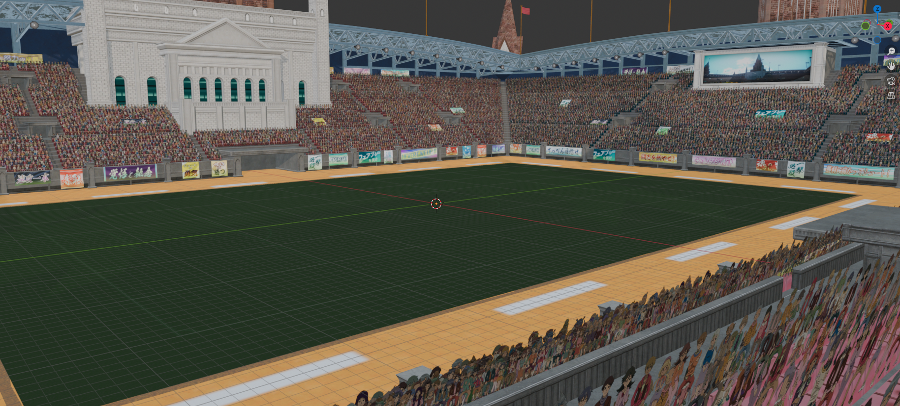
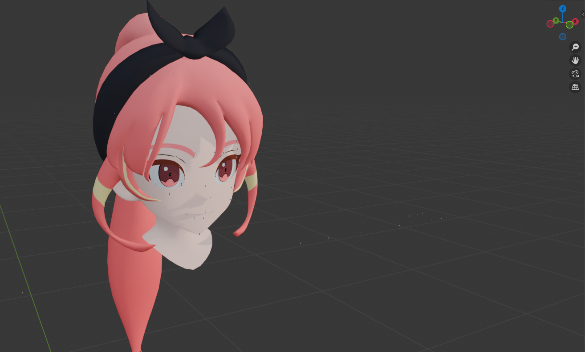
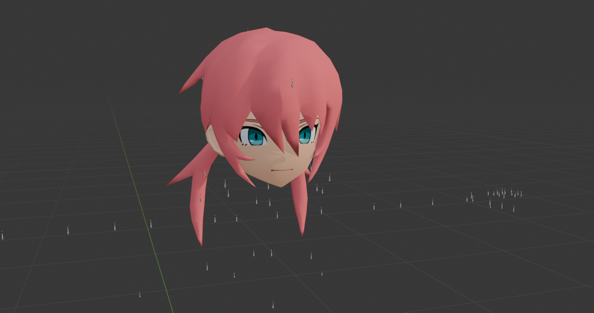

# Level-5 G4 Blender Tools

Blender add-on for importing Level-5 G4 assets and porting edited geometry back to conservative native packages. It supports models, characters, maps and textures used by G4-based games.

The exporter patches a legally obtained native base instead of rebuilding unknown format tables from scratch. This preserves the original layout, material references, hashes, palettes and texture structure whenever possible.

The current stabilization branch also contains a Blender-free native foundation
under `formats/`, `shading/` and `effects/`. It records source evidence before
admitting a format, keeps diagnostics separate from UI code, and treats G4MA
as a controller for effect-shader parameters as well as material animation.

An untouched model imported from its original G4MD is preserved byte-for-byte on export by default. **Preserve Untouched Native Import** copies its original G4MD, G4MG and G4TX files only when every assigned imported mesh still matches its import snapshot. Moving geometry, changing UVs or assigning a different source mesh automatically falls back to the normal port process.



## What it does

| Area | Capabilities |
| --- | --- |
| Models | Import individual assets or folders, create materials, extract textures and assign them automatically. |
| Characters | Build character rigs, resolve shared skeletons, attach modular body parts and preserve skin weights. |
| Maps | Reconstruct map placement, transforms and linked instances from world hierarchies. |
| Rendering | Preserve and extend the existing character Toon shader, with separate map, water, grass and effect profiles. |
| Effects | Read confirmed G4MA/G4MT/G4CM banks and expose conservative, marked previews for animated material/effect parameters. |
| Porting | Export edited Blender or DAE geometry to native `G4MD`/`G4MG` pairs and update compatible `G4TX` archives. |

## Supported formats

| Format | Use |
| --- | --- |
| `G4MD` | Model files |
| `G4PKM` | Packed model containers |
| `G4SK` | Skeletons |
| `G4TX` | Texture archives |
| `NXTCH` | Nintendo Switch texture payloads |
| `G4MA` | Material and effect parameter animation banks |
| `G4MT` | Animation-bank directory and clips |
| `G4CM` | Camera-animation bank structure |
| `CfgBin` | Confirmed T2B/RDBNP configuration resources |

## Installation

Install the release ZIP, or package the `G4_Blender` directory as a ZIP while keeping its folder name and `__init__.py` at the add-on root.

1. In Blender, open **Edit > Preferences > Add-ons**.
2. Choose **Install from Disk** and select the ZIP.
3. Enable **Level-5 G4 Blender Tools**.

The add-on entry point remains the root `__init__.py`. Native readers and
profiles live in the small `formats/`, `shading/` and `effects/` packages; the
helper modules and `chara_model_lookup.json` must remain inside the add-on.

### Menu entries

```text
File > Import > Level-5 G4 Model
File > Import > Level-5 G4 Model Folder
File > Import > Attach Level-5 G4 Character Parts
File > Export > Level-5 G4 Port
View3D > Sidebar > Level-5 > G4 Port
```

## Importing assets

### Models and textures

Import a model directly from Blender, drag it into the viewport, or import a folder in batch. The add-on extracts compatible textures, builds materials and assigns them to the mesh. It also imports character and map assets with the appropriate material treatment instead of applying the character shader indiscriminately.

Map assets use separate terrain, water, grass, cutout and map-PBR profiles.
Water and grass previews add conservative detail/normal treatment while
preserving authored texture links. Character assets retain the existing
Level-5-style Eevee material with hard shadow bands, native normal-map
decoding, recolour-mask controls, wetness and outline parameters. Source
`COLOR` data is kept as **G4 Outline Parameters**, and the original line
texture remains available as **G4 Line Parameter**.

### Character rigging




Character heads named `cXXXXXXXX` can be combined with separate components:

| Prefix | Part |
| --- | --- |
| `uXXXXXXXX` | Body |
| `sXXXXXXXX` | Shoes |
| `skXXXXXXXX` | Arms and neck, where available |
| `g`, `m`, `n` | Gloves, captain armband and nameplate |

Use the character-parts dialog during model import, or select **Attach Level-5 G4 Character Parts** to add components to an existing rig. The importer never guesses a uniform from an ID: cancelling a body or shoes selection simply skips that part. Secondary LOD meshes are discarded so multiple LODs do not deform together.

Many character models reference a shared skeleton rather than embedding one locally. `chara_model_lookup.json` helps locate it, but the add-on still requires a complete legal game dump with the shared skeletons, typically under `data/common/chr/`. Joint names are resolved through the model's CRC32 palette, not by palette order or mesh shape, so modular parts can target the correct bones reliably.

`Apply Bone Orientation` is optional and improves the visual orientation of imported bones in the viewport.

### Outlines and character parameters

The **Character Outline** preference has three modes:

| Mode | Result |
| --- | --- |
| **Detailed** | Default. Filtered silhouette plus selected authored seam details and viewport cavity lines. |
| **Simple** | Filtered silhouette and viewport outline only. |
| **Off** | Disables both outline paths. |

**Outline Thickness** controls the main silhouette in pixels; its default of `1.65` matches the game reference. Eye and mouth helper planes are excluded from contours. Authored line textures and low `COLOR.B` weights select the restrained secondary silhouette where appropriate.

Character meshes also receive a **Level-5 Character Parameters** Geometry Nodes modifier. It is added for character imports from `chr` even when a shared uniform part has no texture of its own, so externally controlled character shading remains available on modular bodies. Shared `_uniform` models also fall back to their family G4TX directory when no converted `chara_parts` lookup is present, letting standalone imports such as `u000101` resolve `u000101_20`/`u000101_30` texture sets and receive the Character shader. The modifier exposes saturation, brightness, light and shadow floors, normal strength, specular strength and wetness without requiring shader-graph edits. When the selected mesh uses the Character shader, the modifier context also shows labelled texture slots for the material's base, mask, normal, occlusion, line, specular and alpha image nodes. **Load Character G4TX** in the same modifier panel extracts a selected `.g4tx` into the import cache and loads its images into Blender; matching texture roles are assigned automatically when possible, otherwise the loaded images remain available for manual selection in the texture fields.

## Map reconstruction

For a complete map, select the world directory itself, such as `w10`, `w11` or `w12`, and enable recursive folder import. The importer reads the world-level `.g4pk` or `.g4pkm` hierarchy, matches scene nodes to model assets, composes transforms, converts G4 Y-up coordinates to Blender Z-up, and uses linked object data for repeated assets.

Auxiliary shadow and culling objects are hidden automatically. Models absent from the render hierarchy still import unchanged; the add-on does not invent placements for them. When present, a matching native half-float DDS cubemap is converted to equirectangular Radiance HDR and used as a restrained world environment.

## Porting edited models

The port exporter writes edited Blender or DAE geometry into a native `G4MD`/`G4MG` pair. Start from a compatible original model from a complete legal game dump; that base defines the record structure, materials, palettes and texture archive the exporter can safely patch.

The exporter:

* Preserves native layouts, material references, hashes and record structure where possible.
* Resolves Collada skin controllers and Blender-exported weight sidecars.
* Validates generated records, palettes, indices and packed-weight sums before writing packages.
* Copies or rebuilds `G4TX` archives from the native base.
* Handles Nintendo Switch `NXTCH` texture payloads, with automatic `dx11` to `nx` fallback.
* Builds port settings from the selected original model rather than using model-specific bone presets.

### Texture replacement

Texture replacement is deliberate and non-destructive:

1. Assign each Blender mesh to its original G4MD record.
2. Open **Prepare and review atlas**, then choose **Prepare Atlas**. Review the destination G4TX texture, source state and whether the atlas is ready, stale or native.
3. Export. Optionally enable **Regenerate Atlas On Export** to refresh it automatically.

The default atlas source is the first diffuse image used by the mesh. **Atlas Source** lets you override it. Empty, stale or unreadable entries never write blank textures or UV-guide PNGs: the exporter removes only its failed generated atlas, logs a warning and keeps the native G4TX payload. Atlas cells are deterministic (record order, then object name), laid out left-to-right and top-to-bottom. Generated cells include a small edge gutter and transparent-pixel colour bleed so filtering does not create black outlines or sample a neighbour. Meshes that share the same normal source image share the exact same atlas-cell transform, preserving their authored relative UV placement; only meshes with repeated or out-of-range UVs receive an isolated projected cell and a fitted transform. Object UV tiles are exported only for a base texture that is actually replaced; native textures keep their original UVs. Enabling **Regenerate Atlas On Export**, **Use Object UV Tiles** or **Auto Pack Object UVs** is treated as an explicit atlas export and never falls back to a byte-for-byte native copy. `line`, `oc`, `sp` and `spm` maps are preserved unless **Replace Special Maps** is enabled *and* a valid source map exists; unavailable special maps never receive implicit solid-colour replacements.


`eye_10` and `mouth_10` share the native facial texture (`*_10`) and therefore never create a new base atlas. Generic replacement paths for that entry are ignored deliberately: they would invalidate its authored UV windows. A prepared atlas from another model can be accepted explicitly through **Existing 4x2 Atlas** and **Use Existing 4x2 Atlas**. Alternatively, initialize **Expression pool**, provide eight images in row-major order (Cell 1–4 are the top row; 5–8 the bottom row), then choose **Build 4x2 Expression Atlas**. A pool maps the source face and mouth into Cell 1 (top-left); an accepted existing atlas leaves their authored UV windows intact. Both routes replace only the shared facial G4TX entry; until then, its native payload is preserved.

Atlas diagnostics are written to `atlas_uv_trace.log` in the configured export cache. It lists each source image, UV bounds, atlas cell, scale and offset, then appends the exact converter command and its output. Analysis/export reports also include `uv_transform_trace` for every generated native record.

Atlas offsets are authored in Blender image space and converted automatically when the G4 V flip is enabled, so the visible top row remains the top row in the exported model.

## Requirements

* Blender 4.0 or newer
* Python 3.10 or newer
* Pillow available to Blender/Python when rebuilding custom textures

## Disclaimer

This independent community tool is intended for interoperability, research and modding. It contains no original game models, textures, audio or other playable assets. The included lookup database is derived from game metadata solely to support automatic skeleton resolution and rigging.

Provide your own legally obtained game files. This project is not affiliated with, endorsed by or associated with Level-5.

## Special thanks

* **TheWonderVal** — outline logic, rigging testing and bug reporting.
* **KatamariEnjoyer** — testing and bug reporting.
* **daniguay87** — rigging testing and bug reporting.
* **DaRk_Proaso** — porting testing.
* **DaniKH** — batch-importing and shading support, rigging testing and bug reporting.
* **Victory Road España**.

## Animation import (1.5.0)

The G4MT/G4PK importer creates separate Actions for all independent clips in
its selected bank. Leave **Active Animation** empty to start with the first
clip longer than two frames, or enter an exact name/index. Disable **Import All
Animations** to import only that selection. Additive clips still require a
base animation and are reported as skipped.

Normal imports retain animated root bones. Event root extraction now uses
the same bone delta and rest basis, preserving the resulting world pose
instead of converting the coordinate system twice. Existing Actions need to
be reimported to receive the fix.

Validation covers both banks of the reported Yo-Kai Watch 4 y03150000 model
(8 and 24 clips) in Blender 4.5.10 and 5.2, a Gakuen Y bank, and six Victory
Road event cuts with world-matrix and skinned-vertex comparisons. This does
not establish native-game equivalence or support for additive blending.

### Event placement and animation skeletons (1.6.2)

Event imports now apply per-cut actor attachments from `event_cfg/evt` or
`event_cfg/vis` to the corresponding `point_sXX` animation and `evpXX` joint.
The placement is composed with the actor's animated root, preserving both
layers. Missing referenced points are reported before creating the actor.

This fixes the clustered actors and distant-camera mismatch in `ev20_03500`.
Its complete import was checked with 13 actors, 37 actor cuts and 14 camera
cuts, including renders through the original cameras. If an event contains
point packages but its event_cfg or point motions cannot be resolved, the
import now records the placement counts in scene custom properties and shows
a warning instead of silently leaving actors at their local animation
positions. All companion resources are resolved from the selected data root
that contains `common`; keep the event_cfg and point assets under that same
data root. Reimport existing events to apply the correction.

The same direct data-root rule is used by the G4MT skeleton lookup, the model
importer, animation companions, event resources and character-part metadata.
No neighboring `raw/data` or `readable/data` directory is added implicitly.

Event character defaults also attach the matching `sk000xxx` arms mesh beside
the selected `u000xxx` body, including direct event-operator imports that skip
the character-parts dialog. The mesh is rebound to the actor's animated
armature and follows the same shared skeleton.

Animation imports now establish the selected model's data root before looking
up its external G4SK. This keeps models whose skeleton is shared through the
character catalog on the same bind skeleton as their animation and prevents
localized bone deformation when the importer starts in a fresh Blender
session.

Event character assembly also reads the native `chara_parts*.cfg.bin` tables
when they are available. The declared body profile selects the matching
`u000xxx` mesh and its paired `sk000xxx` accessory, so modular characters no
longer fall back to the profile-0 arms. Event `event_cfg` model substitutions
are applied before this lookup, and the animation importer passes every part
slot by name so a body cannot be attached as shoes by argument position.

The joint palette resolver prefers a complete named source-skeleton mapping
when a separated character part exposes more named joints than the partial
CRC32 palette. This preserves the CRC32 path while avoiding unresolved arm
weights on compact character rigs.

The event character-parts dialog now starts each actor from the model declared
by `event_cfg`, including its body, shoes and matching arms. Existing saved
choices remain available, and changing the head continues to refill the
modular parts for that head. Legacy saved paths that point directly to a base
folder such as `_uniform/u000101/u000101.g4md` are treated as old fallbacks and
are replaced by the event profile in both the dialog and direct batch imports.
Profile-specific paths such as `_uniform/u000101/u000102.g4md` remain explicit
choices. Character event packages that embed their `G4MA` material animation
now receive the same facial-atlas UV animation even when **Import Effects** is
disabled; effect meshes remain controlled by that option.
